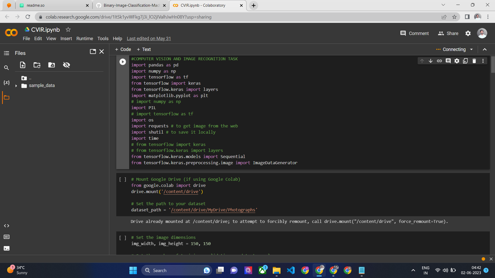
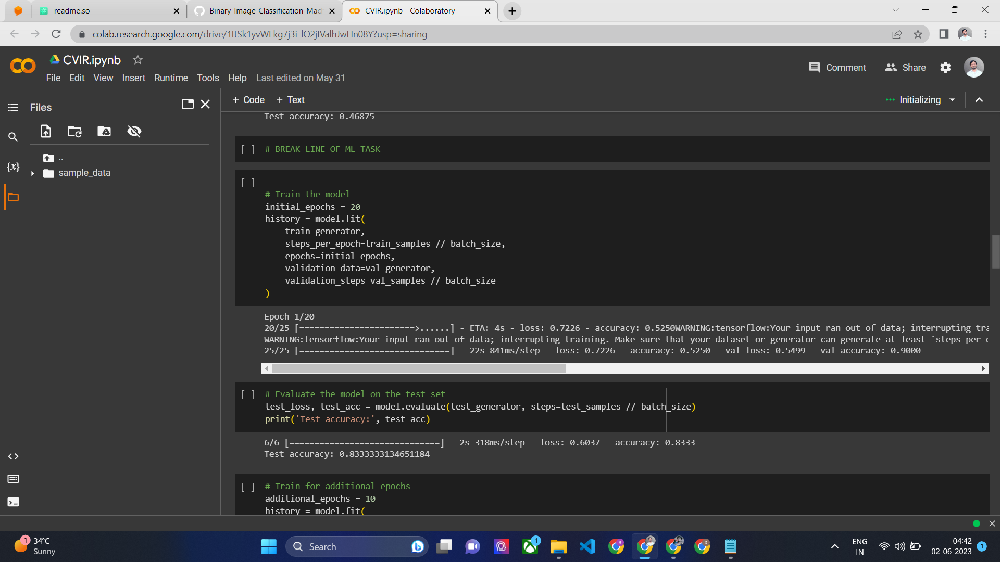

# Binary Image Classification in Machine Learning using Google Colab


## Objective
The main objective of this project, developed for my client Abhishek Ganguly, is to perform binary image classification. We will use Google Colab, Python, and popular machine learning libraries such as TensorFlow and Keras to build an efficient image classifier. The goal is to accurately classify images into two distinct categories based on their content.

## Dataset
The dataset used in this binary image classification project consists of a collection of images. Each image is labeled with either a positive or negative class, representing the two distinct categories we aim to classify.

 Drive URL : https://drive.google.com/drive/folders/1dLrCrI1R7Ej2Pu-rzAsBXNGKJedoGkSc?usp=sharing
 
## Setup
To run the code for this binary image classification project in Google Colab, please follow these steps:

- Download the code script and dataset.
- Import the dataset into Google Colab.
- Copy and paste the code script into Google Colab.
- Run the code cells sequentially to execute the project.

## Google Colab
URL: https://colab.research.google.com/drive/1ItSk1yvWFkg7j3i_lO2jIValhJwHn08Y?usp=sharing


## Screenshots




## Installation
- Launch Google Colab and upload the Jupyter notebook (Image_Classification.ipynb) provided in this repository.
- Open the Jupyter notebook and execute the code cells sequentially to perform binary image classification.

## Contents
The repository contains the following files:

- CVIR.ipynb: Google Colab notebook containing the code for binary image classification.
- Photographs: The dataset consisting of labeled images in a compressed format.

## Usage
The Google Colab notebook (CVIR.ipynb) provides a step-by-step guide on how to perform binary image classification using deep learning techniques. It includes code snippets and explanations for each step.

## Results
Upon executing the code in the Google Colab notebook, you will obtain the following outcomes:

- Training a deep learning model on the provided dataset to classify images into positive and negative classes.
- Evaluation of the model's performance using appropriate metrics such as accuracy, precision, and recall.
- Visualizations of the model's predictions and analysis of the classification results.

##  Conclusion
Binary image classification is a challenging task that requires appropriate data preprocessing, model training, and evaluation. By following the steps outlined in the provided Google Colab notebook, you will be able to develop an image classifier that can accurately classify new images into the specified categories.


## Alternate Guide
This is a beginner-friendly guide that will walk you through the process of binary image classification using Google Colab. It is developed in Python and popular machine learning libraries such as TensorFlow and Keras to build an efficient image classifier.

## Table of Contents
- Introduction
- Prerequisites
- Setting up Google Colab
- Data Preparation
- Building the Model
- Training the Model
- Evaluating the Model
- Conclusion
- References

## 1. Introduction <a name="introduction"></a>
Binary image classification is a common task in machine learning, where we aim to classify images into one of two classes. For example, we can train a model to distinguish between cats and dogs based on their images. In this guide, we will use a deep learning approach to train a model to perform binary image classification.

## 2. Prerequisites <a name="prerequisites"></a>
Before we begin, make sure you have the following:

- Basic understanding of Python and machine learning concepts.
- Google account to access Google Colab.
- Dataset consisting of labeled images for training and testing.

## 3. Setting up Google Colab <a name="setting-up-google-colab"></a>
- Go to Google Colab and sign in with your Google account.
- Click on "New Notebook" to create a new Colab notebook.
- Rename the notebook by clicking on the "Untitled" title at the top.
- You are now ready to start coding in the Colab environment.

## 4. Data Preparation <a name="data-preparation"></a>
- Upload your dataset to Google Colab by clicking on the folder icon on the left sidebar and selecting the relevant files.
- Import the necessary libraries in your Colab notebook:

```python
import numpy as np
import pandas as pd
import matplotlib.pyplot as plt
import tensorflow as tf
from tensorflow import keras

```

- Load and preprocess your dataset:

```python
# Load the dataset
data = pd.read_csv('your_dataset.csv')

# Split the dataset into features (X) and labels (y)
X = data.drop('label', axis=1)
y = data['label']

# Preprocess the data (e.g., scaling, normalization, etc.)
# ...

```

## 5. Building the Model <a name="building-the-model"></a>
- Create a model architecture using Keras:


```python
# Initialize a sequential model
model = keras.models.Sequential()

# Add layers to the model
model.add(keras.layers.Conv2D(32, (3, 3), activation='relu', input_shape=(32, 32, 3)))
model.add(keras.layers.MaxPooling2D((2, 2)))
model.add(keras.layers.Flatten())
model.add(keras.layers.Dense(128, activation='relu'))
model.add(keras.layers.Dense(1, activation='sigmoid'))

# Compile the model
model.compile(optimizer='adam', loss='binary_crossentropy', metrics=['accuracy'])

```
- Adjust the model architecture based on your specific requirements.

## 6. Training the Model <a name="training-the-model"></a>
- Split your dataset into training and testing sets:


```python

from sklearn.model_selection import train_test_split

X_train, X_test, y_train, y_test = train_test_split(X, y, test_size=0.2, random_state=42)


```

- Train the model on the training set:


```python

model.fit(X_train, y_train, epochs=10, batch_size=32)

```

- Adjust the number of epochs and batch size based on your dataset and computational resources.

## 7. Evaluating the Model <a name="evaluating-the-model"></a>
- Evaluate the model performance on the testing set:

```python

test_loss, test_accuracy = model.evaluate(X_test, y_test)
print(f'Test Loss: {test_loss:.4f}')
print(f'Test Accuracy: {test_accuracy:.4f}')

```

- Use additional evaluation metrics to assess the model's performance (e.g., precision, recall, F1-score, etc.).

## 8. Conclusion <a name="conclusion"></a>
Congratulations! You have successfully trained a binary image classification model using Google Colab. Remember to experiment with different architectures, hyperparameters, and preprocessing techniques to improve your model's performance.

## 9. References <a name="references"></a>
Here are some references to further explore binary image classification and Google Colab:

- TensorFlow documentation: https://www.tensorflow.org/
- Keras documentation: https://keras.io/
- Google Colab documentation: https://colab.research.google.com/notebooks/intro.ipynb


## Developer 
Himanshu Hada
himanshuhada380@gmail.com


## License

[MIT](https://choosealicense.com/licenses/mit/)
